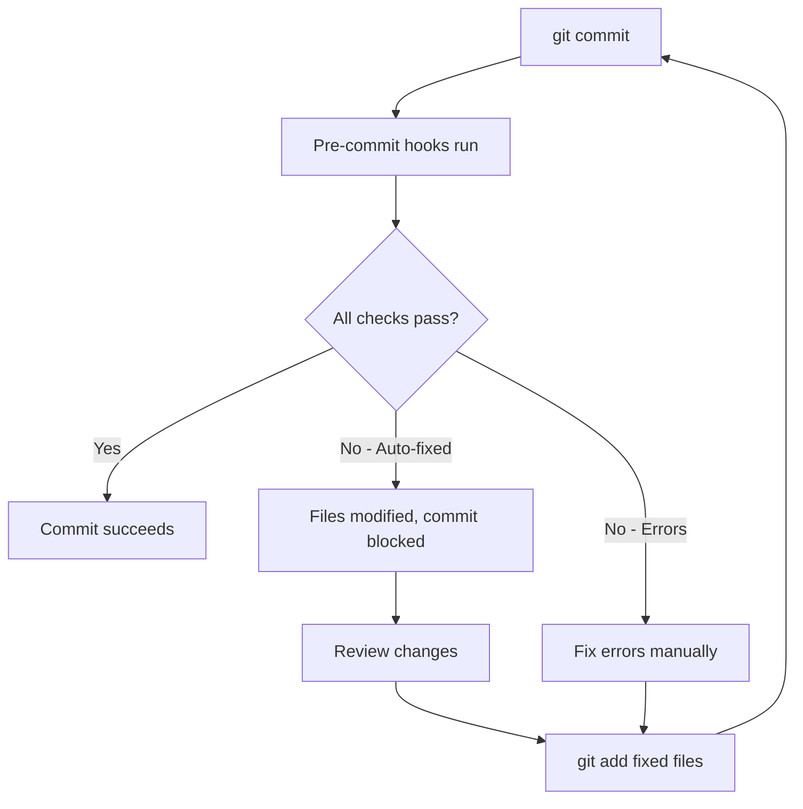

# Pre-commit Hooks Guide

This guide covers the pre-commit hooks setup for maintaining code quality in the Biotech Terminal Platform.

## Overview

Pre-commit hooks automatically check and format code before each commit:
- **Python**: Black (formatting), isort (imports), Flake8 (linting), Ruff (fast linting), Bandit (security)
- **JavaScript/TypeScript**: Prettier (formatting), ESLint (linting)
- **General**: Trailing whitespace, end-of-file fixes, YAML validation, merge conflict detection

## Quick Start

### Installation

1. **Install pre-commit**:
```bash
# Using pip
pip install pre-commit

# Or using Poetry (recommended)
poetry add --group dev pre-commit

# Or it's already in pyproject.toml
poetry install
```

2. **Install git hooks**:
```bash
# Install hooks for this repository
poetry run pre-commit install

# Or without Poetry
pre-commit install
```

3. **Verify installation**:
```bash
# Check that hooks are installed
poetry run pre-commit --version
```

### First Run

Run hooks on all files to ensure everything is configured correctly:

```bash
# Run all hooks on all files
poetry run pre-commit run --all-files

# Or without Poetry
pre-commit run --all-files
```

This will:
- Format all Python files with Black
- Sort imports with isort
- Lint Python code with Flake8 and Ruff
- Format JavaScript/TypeScript with Prettier
- Run ESLint on JavaScript/TypeScript
- Check for common issues (trailing whitespace, large files, etc.)

## How It Works

### Automatic Checks on Commit

Once installed, hooks run automatically on `git commit`:

```bash
# Stage files
git add my_file.py

# Commit triggers pre-commit hooks
git commit -m "Add new feature"

# Hooks run automatically:
# - Black formats Python code
# - isort sorts imports
# - Flake8 checks for errors
# - Prettier formats JS/TS
# - etc.

# If hooks pass, commit succeeds
# If hooks fail or make changes, commit is blocked
```

### Workflow



## Configured Hooks

### Python Hooks

#### Black (Code Formatter)
- **What**: Formats Python code to consistent style
- **Config**: `pyproject.toml` - line length 88, Python 3.9+
- **Auto-fix**: Yes
- **Example**:
```python
# Before Black
def my_function(  arg1,arg2,  arg3  ):
    return arg1+arg2+arg3

# After Black
def my_function(arg1, arg2, arg3):
    return arg1 + arg2 + arg3
```

#### isort (Import Sorter)
- **What**: Sorts and organizes Python imports
- **Config**: `pyproject.toml` - Black-compatible profile
- **Auto-fix**: Yes
- **Example**:
```python
# Before isort
import os
from typing import List
import sys
from bt_platform.core.app import app

# After isort
import os
import sys
from typing import List

from bt_platform.core.app import app
```

#### Flake8 (Linter)
- **What**: Checks Python code for errors and style issues
- **Config**: `.pre-commit-config.yaml` - max line length 88
- **Auto-fix**: No (reports errors only)
- **Checks**: PEP 8 compliance, unused imports, undefined names
- **Ignored**: E203, W503, E501 (Black-compatible)

#### Ruff (Fast Linter)
- **What**: Modern, fast Python linter (Rust-based)
- **Config**: `pyproject.toml` - similar rules to Flake8
- **Auto-fix**: Yes (with `--fix` flag)
- **Checks**: Errors, style issues, best practices
- **Much faster**: 10-100x faster than Flake8

#### Bandit (Security Checker)
- **What**: Finds common security issues in Python code
- **Config**: `.pre-commit-config.yaml` - low/low level
- **Auto-fix**: No (reports security issues only)
- **Checks**: SQL injection, hardcoded passwords, insecure functions
- **Skipped**: B101 (assert_used), B601 (paramiko_calls)

### JavaScript/TypeScript Hooks

#### Prettier (Code Formatter)
- **What**: Formats JavaScript/TypeScript/JSON/YAML/Markdown
- **Config**: `.prettierrc.json`
- **Auto-fix**: Yes
- **Example**:
```typescript
// Before Prettier
const obj={name:"test",value:123,items:[1,2,3]};

// After Prettier
const obj = {
  name: "test",
  value: 123,
  items: [1, 2, 3],
};
```

#### ESLint (Linter)
- **What**: Checks JavaScript/TypeScript for errors and style issues
- **Config**: `eslint.config.js`
- **Auto-fix**: Yes (with `--fix` flag)
- **Checks**: React hooks rules, TypeScript best practices, unused variables

### General Hooks

#### Trailing Whitespace
- Removes trailing whitespace from files
- Auto-fix: Yes

#### End of File Fixer
- Ensures files end with newline
- Auto-fix: Yes

#### Check YAML
- Validates YAML syntax
- Auto-fix: No

#### Check JSON
- Validates JSON syntax
- Auto-fix: No
- Excludes: `package-lock.json`

#### Check Added Large Files
- Prevents committing files larger than 1MB
- Configurable threshold
- Auto-fix: No (blocks commit)

#### Check Merge Conflict
- Detects merge conflict markers (`<<<<<<<`, `=======`, `>>>>>>>`)
- Auto-fix: No

#### Detect Private Key
- Prevents committing private keys
- Auto-fix: No (blocks commit)

## Configuration Files

### `.pre-commit-config.yaml`

Main configuration file for pre-commit hooks:

```yaml
repos:
  # Black formatter
  - repo: https://github.com/psf/black
    rev: 24.3.0
    hooks:
      - id: black
        language_version: python3.9
        args: [--config=pyproject.toml]
        files: ^bt_platform/.*\.py$

  # More hooks...
```

### `pyproject.toml`

Python tool configurations:

```toml
[tool.black]
line-length = 88
target-version = ['py39']

[tool.isort]
profile = "black"
line_length = 88

[tool.ruff]
line-length = 88
target-version = "py39"
```

### `.prettierrc.json`

Prettier configuration:

```json
{
  "semi": true,
  "trailingComma": "es5",
  "singleQuote": false,
  "printWidth": 100,
  "tabWidth": 2
}
```

## Usage

### Running Manually

```bash
# Run on all files
poetry run pre-commit run --all-files

# Run on specific files
poetry run pre-commit run --files bt_platform/core/app.py

# Run specific hook
poetry run pre-commit run black --all-files
poetry run pre-commit run prettier --all-files

# Skip hooks for a commit (not recommended)
git commit -m "Message" --no-verify
```

### Updating Hooks

```bash
# Update hooks to latest versions
poetry run pre-commit autoupdate

# This updates the 'rev' fields in .pre-commit-config.yaml
```

### Temporarily Disabling Hooks

```bash
# Disable for single commit
git commit -m "WIP: Work in progress" --no-verify

# Uninstall hooks completely
poetry run pre-commit uninstall

# Reinstall later
poetry run pre-commit install
```

## CI/CD Integration

### GitHub Actions

Pre-commit runs automatically in CI/CD:

```yaml
# .github/workflows/pre-commit.yml
name: Pre-commit

on: [push, pull_request]

jobs:
  pre-commit:
    runs-on: ubuntu-latest
    steps:
      - uses: actions/checkout@v3
      - uses: actions/setup-python@v4
      - uses: pre-commit/action@v3.0.0
```

### Local CI Simulation

```bash
# Run the same checks as CI
poetry run pre-commit run --all-files --show-diff-on-failure
```

## Troubleshooting

### "command not found: pre-commit"

**Solution**:
```bash
# Install pre-commit
poetry install

# Or with pip
pip install pre-commit
```

### Hooks not running on commit

**Solution**:
```bash
# Reinstall hooks
poetry run pre-commit install

# Verify installation
ls -la .git/hooks/pre-commit
```

### Black and Flake8 conflict

**Cause**: Flake8 and Black have different opinions on line length

**Solution**: Use Black-compatible Flake8 config (already configured):
```yaml
args: [--max-line-length=88, --extend-ignore=E203,W503,E501]
```

### Ruff and other tools conflict

**Cause**: Ruff might auto-fix things other tools complain about

**Solution**: Run hooks in correct order (already configured):
1. Black (formatter)
2. isort (imports)
3. Flake8/Ruff (linters)

### "This repository is not using a supported version"

**Cause**: pre-commit version mismatch

**Solution**:
```bash
# Update pre-commit
poetry update pre-commit

# Update hooks
poetry run pre-commit autoupdate
```

### Hooks take too long

**Cause**: Running on many files

**Solutions**:
1. Only run on staged files (default behavior)
2. Use faster tools (Ruff instead of Flake8)
3. Skip slow hooks temporarily: `SKIP=bandit git commit`

### Want to commit without fixing issues

**Not recommended**, but if necessary:
```bash
# Skip hooks for one commit
git commit -m "WIP" --no-verify

# Remember to fix later!
```

## Best Practices

### Daily Development

1. **Install hooks immediately**: Set up on first clone
2. **Run frequently**: Don't let issues accumulate
3. **Fix issues promptly**: Address errors before committing
4. **Review auto-fixes**: Check what formatters changed
5. **Don't skip hooks**: They catch issues early

### Team Collaboration

1. **Shared configuration**: Keep `.pre-commit-config.yaml` in git
2. **Document**: Include setup in README
3. **Onboarding**: Help new team members set up hooks
4. **Update together**: Coordinate hook updates
5. **CI enforcement**: Run pre-commit in CI/CD

### Configuration

1. **Start simple**: Begin with essential hooks
2. **Add gradually**: Introduce new hooks incrementally
3. **Team consensus**: Agree on formatting rules
4. **Document exceptions**: Explain why rules are disabled
5. **Keep updated**: Regularly update hook versions

## Custom Hooks

### Adding a New Hook

Edit `.pre-commit-config.yaml`:

```yaml
repos:
  # Add MyPy type checking
  - repo: https://github.com/pre-commit/mirrors-mypy
    rev: v1.7.1
    hooks:
      - id: mypy
        args: [--config=pyproject.toml]
        additional_dependencies: [types-all]
        files: ^bt_platform/.*\.py$
```

Then install:
```bash
poetry run pre-commit install
poetry run pre-commit run mypy --all-files
```

### Creating a Local Hook

```yaml
repos:
  # Custom script
  - repo: local
    hooks:
      - id: check-version
        name: Check version consistency
        entry: python scripts/check_version.py
        language: python
        files: ^(pyproject\.toml|package\.json)$
```

## IDE Integration

### VS Code

Install extensions:
- **Python**: ms-python.python (includes Black, isort)
- **Prettier**: esbenp.prettier-vscode
- **ESLint**: dbaeumer.vscode-eslint

Settings (`.vscode/settings.json`):
```json
{
  "editor.formatOnSave": true,
  "python.formatting.provider": "black",
  "[python]": {
    "editor.codeActionsOnSave": {
      "source.organizeImports": true
    }
  },
  "[typescript]": {
    "editor.defaultFormatter": "esbenp.prettier-vscode"
  }
}
```

### PyCharm

1. **Black**: Settings → Tools → Black → Enable
2. **isort**: Settings → Tools → isort → Enable
3. **Prettier**: Settings → Languages → Prettier → Enable
4. **ESLint**: Settings → Languages → ESLint → Enable

## Comparison with Manual Checking

| Aspect | Pre-commit Hooks | Manual Checking |
|--------|-----------------|-----------------|
| **Speed** | Automatic, instant feedback | Slow, manual process |
| **Consistency** | Enforced automatically | Easy to forget |
| **Coverage** | All staged files | Might miss files |
| **Team alignment** | Everyone uses same rules | Varies by developer |
| **CI/CD** | Same checks locally and in CI | Might differ |
| **Learning curve** | Initial setup required | No setup needed |

## Performance Tips

### Faster Hooks

1. **Use Ruff instead of Flake8**: 10-100x faster
2. **Limit file patterns**: Use `files:` regex to target specific paths
3. **Skip in CI**: Some hooks can skip in CI if they run locally
4. **Cache**: Pre-commit caches hook installations

### Example: Fast Configuration

```yaml
repos:
  # Use Ruff for everything
  - repo: https://github.com/astral-sh/ruff-pre-commit
    rev: v0.3.4
    hooks:
      - id: ruff
        args: [--fix]
      - id: ruff-format  # Ruff's formatter (Black-compatible)
```

## Migration Guide

### From No Hooks to Pre-commit

1. **Install**: `poetry run pre-commit install`
2. **Run once**: `poetry run pre-commit run --all-files`
3. **Fix issues**: Address all reported problems
4. **Commit**: Commit the fixes
5. **Document**: Update README with setup instructions

### From Custom Scripts to Pre-commit

1. **List current scripts**: Identify what you're already running
2. **Find equivalent hooks**: Search pre-commit hook repositories
3. **Configure**: Add hooks to `.pre-commit-config.yaml`
4. **Test**: Run on all files to verify
5. **Remove old scripts**: Delete custom scripts once hooks work

## Resources

- [Pre-commit Documentation](https://pre-commit.com/)
- [Pre-commit Hooks Repository](https://github.com/pre-commit/pre-commit-hooks)
- [Black Documentation](https://black.readthedocs.io/)
- [Ruff Documentation](https://docs.astral.sh/ruff/)
- [Prettier Documentation](https://prettier.io/docs/)
- [ESLint Documentation](https://eslint.org/docs/)

## FAQ

**Q: Do I need to run `poetry run` every time?**
A: Only if you installed pre-commit with Poetry. If installed globally with pip, just use `pre-commit`.

**Q: Can I use pre-commit without Poetry?**
A: Yes! Install with `pip install pre-commit` and use `pre-commit` directly.

**Q: Why did my commit fail?**
A: Hooks found issues. Review the output, fix the issues, re-stage files, and commit again.

**Q: Can I customize the rules?**
A: Yes! Edit configuration files (`pyproject.toml`, `.prettierrc.json`, etc.) and `.pre-commit-config.yaml`.

**Q: How do I add a new hook?**
A: Edit `.pre-commit-config.yaml`, add the hook, run `poetry run pre-commit install`, then test with `poetry run pre-commit run hook-name --all-files`.

**Q: Should I commit with `--no-verify`?**
A: Avoid it. Hooks exist to maintain quality. Only use in emergencies, and fix issues immediately after.
